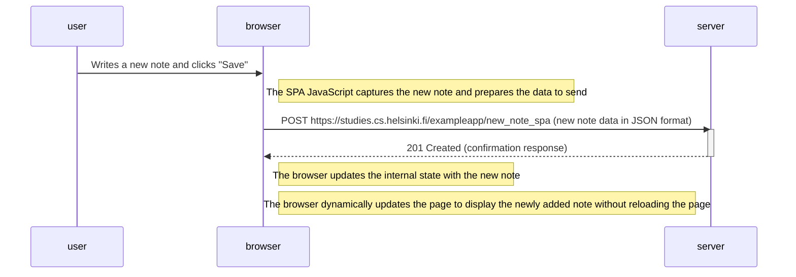

```mermaid
sequenceDiagram
    participant user
    participant browser
    participant server

    user->>browser: Writes a new note and clicks "Save"
    
    Note right of browser: The SPA JavaScript captures the new note and prepares the data to send

    browser->>server: POST https://studies.cs.helsinki.fi/exampleapp/new_note_spa (new note data in JSON format)
    activate server
    server-->>browser: 201 Created (confirmation response)
    deactivate server
    
    Note right of browser: The browser updates the internal state with the new note


    Note right of browser: The browser dynamically updates the page to display the newly added note without reloading the page
```
